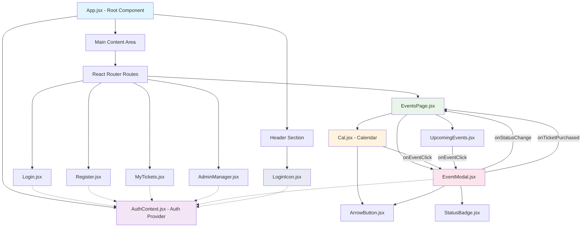

# React Component Diagram - Event Booking Platform

## AI Assistance Disclosure

This React Component Diagram and accompanying documentation were generated with significant
assistance from AI coding agents, as permitted by the instructor. The AI assistance included:

- **Diagram Generation**: Creating the visual Mermaid diagram and component hierarchy
- **Documentation Structure**: Organizing and formatting the comprehensive documentation
- **Analysis**: Analyzing the existing codebase structure and component relationships
- **Descriptions**: Writing detailed component descriptions and architectural patterns

The AI tools worked with the author's existing implementation, which includes:
- Frontend components developed with AI assistance
- Spring Boot backend implemented with AI collaboration
- Manual implementation of core event functionality by the author

This collaborative approach between human and AI was explicitly allowed for this capstone project.


## Overview
This document outlines the React component architecture for the Event Booking Platform application. The diagram shows component relationships, data flow, and architectural patterns.

## Mermaid Diagram



## Component Hierarchy (Text Version)

### Level 1: Application Root
```
App.jsx (Root Component)
├── AuthProvider (Context)
├── Header
│   └── LoginIcon
└── Main Content
    └── React Router Routes
```

### Level 2: Page Components (Routes)
```
Routes
├── / → EventsPage.jsx
├── /login → Login.jsx
├── /register → Register.jsx
├── /my-tickets → MyTickets.jsx
└── /admin-manager → AdminManager.jsx
```

### Level 3: EventsPage Component Tree
```
EventsPage.jsx
├── Cal.jsx (Calendar Component)
│   └── ArrowButton.jsx (Reusable)
├── UpcomingEvents.jsx
└── EventModal.jsx
    ├── StatusBadge.jsx (Reusable)
    └── ArrowButton.jsx (Reusable)
```

### Level 4: Shared/Reusable Components
```
Shared Components:
├── ArrowButton.jsx (Used by Cal & EventModal)
├── StatusBadge.jsx (Used by EventModal)
└── LoginIcon.jsx (Used by Header)
```

## Component Descriptions

### App.jsx (Root Component)
- **Location**: `src/App.jsx`
- **Purpose**: Application shell and routing setup
- **Responsibilities**: 
  - Wraps entire app with AuthProvider
  - Sets up React Router with 5 routes
  - Provides header with LoginIcon
  - Renders main content area

### AuthContext.jsx (Authentication Provider)
- **Location**: `src/contexts/AuthContext.jsx`
- **Purpose**: Global authentication state management
- **Responsibilities**:
  - Manages current user state
  - Provides login/logout functions
  - Persists user data in localStorage
  - Determines admin privileges

### EventsPage.jsx (Main Page)
- **Location**: `src/pages/EventsPage.jsx`
- **Purpose**: Primary event browsing interface
- **Responsibilities**:
  - Fetches and displays events by month
  - Manages calendar and upcoming events views
  - Handles event selection and modal display
  - Coordinates between child components

### Cal.jsx (Calendar Component)
- **Location**: `src/components/Cal.jsx`
- **Purpose**: Calendar view of events
- **Responsibilities**:
  - Displays monthly calendar grid
  - Shows events on their respective dates
  - Provides month navigation with ArrowButton
  - Triggers EventModal on event click

### EventModal.jsx (Event Details Modal)
- **Location**: `src/components/EventModal.jsx`
- **Purpose**: Detailed event view and interactions
- **Responsibilities**:
  - Shows complete event details
  - Allows ticket purchases (users)
  - Allows status changes (admins)
  - Displays venue information
  - Uses StatusBadge for event status

### AdminManager.jsx (Admin Interface)
- **Location**: `src/pages/AdminManager.jsx`
- **Purpose**: Admin-only event management
- **Responsibilities**:
  - Comprehensive event management
  - Ticket sales monitoring
  - Event status updates
  - Administrative controls

### MyTickets.jsx (User Tickets)
- **Location**: `src/pages/MyTickets.jsx`
- **Purpose**: User ticket management
- **Responsibilities**:
  - Displays user's purchased tickets
  - Shows ticket details and status
  - Provides ticket management options

### Login.jsx & Register.jsx (Authentication)
- **Location**: `src/pages/Login.jsx`, `src/pages/Register.jsx`
- **Purpose**: User authentication forms
- **Responsibilities**:
  - User login with validation
  - New user registration
  - Form error handling
  - Redirect on successful auth

### Reusable Components
- **ArrowButton.jsx**: Directional navigation button
- **StatusBadge.jsx**: Visual status indicator
- **LoginIcon.jsx**: Authentication status in header

## Data Flow Patterns

### Authentication Flow
```
User Action → Login/Register → AuthContext → localStorage → App State
```

### Event Selection Flow
```
Cal/UpcomingEvents → onEventClick → EventModal → Event Details
```

### State Update Flow
```
EventModal → onStatusChange → EventsPage → API Call → State Refresh
EventModal → onTicketPurchased → EventsPage → API Call → State Refresh
```

### Context Consumption
```
AuthProvider → useContext → Login, Register, MyTickets, AdminManager, EventModal, LoginIcon
```

## Architectural Patterns

1. **Provider Pattern**: AuthProvider for global state management
2. **Container/Presenter Pattern**: EventsPage (container) manages state, child components present UI
3. **Reusable Component Pattern**: ArrowButton, StatusBadge follow DRY principle
4. **Modal Pattern**: EventModal for focused interactions
5. **Routing Pattern**: Clean separation with page components
6. **Context Pattern**: Shared authentication state across components

## File Structure
```
src/
├── App.jsx
├── contexts/
│   └── AuthContext.jsx
├── pages/
│   ├── EventsPage.jsx
│   ├── Login.jsx
│   ├── Register.jsx
│   ├── MyTickets.jsx
│   └── AdminManager.jsx
├── components/
│   ├── Cal.jsx
│   ├── EventModal.jsx
│   ├── UpcomingEvents.jsx
│   ├── ArrowButton.jsx
│   ├── StatusBadge.jsx
│   └── LoginIcon.jsx
└── styles/
    ├── base.css
    ├── calendar.css
    ├── modal.css
    └── ... (other CSS files)
```

## Key Design Decisions

1. **Context over Redux**: Used React Context for auth state (simpler, less boilerplate)
2. **Component Composition**: Built complex UIs from simple, reusable components
3. **Separation of Concerns**: Clear division between pages, components, and contexts
4. **Responsive Design**: CSS files organized by component/feature
5. **API Integration**: Direct fetch calls in components (could be refactored to services)

## Future Improvements

1. **Service Layer**: Extract API calls to dedicated service modules
2. **Custom Hooks**: Create reusable hooks for common patterns
3. **Type Safety**: Add PropTypes or TypeScript
4. **Testing**: Add unit and integration tests
5. **State Management**: Consider useReducer for complex state logic

---
*Last Updated: April 21, 2026*  
*Document Version: 1.0*